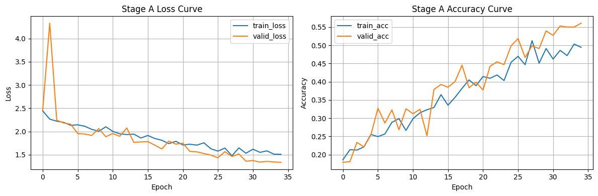
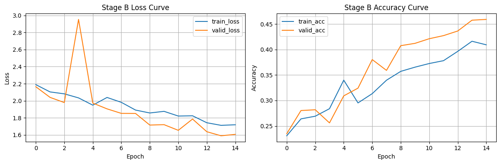

# 2026-04-04 本地开发训练记录

## 这次记录的范围

这份记录整理的是 HW03 从 Colab 环境迁到本地 Windows GPU 后，第一次成型的开发训练信息，重点包括：

- 本地训练时采用的目录结构
- 实际使用的环境和运行配置
- 第一次本地训练后的直接心得

## 使用的结构

当前本地工作目录以 `HW03/` 为核心，结构如下：

- `HW03.ipynb`
  - 主 notebook，负责训练、验证、Stage B 续训和导出 submission。
- `runs/<timestamp>/`
  - 每次训练一个独立目录，保存该次运行的 checkpoint、曲线图、metrics 和 submission 信息。
- `archive/`
  - 保留原始 Colab notebook，以及中间拆出的临时 `.py` 文件，方便对照和回溯。
- `latest_predict.csv`
  - 维持一份稳定的最新提交文件副本，避免不同 run 的输出互相覆盖时难以追踪。

这种结构的好处很直接：

- 训练结果不会混在一起，方便核对“哪个 checkpoint 生成了哪个 CSV”。
- Stage A 和 Stage B 的输出可以并排保留，适合后续对照 Kaggle 分数。
- 曲线图、指标和权重文件都绑在同一轮 run 里，复盘时不需要重新猜配置。

## 本地环境与运行配置

2026-04-04 在本地确认的运行环境如下：

- GPU：`NVIDIA GeForce RTX 5060 Laptop GPU`
- 显存：约 `7.96 GB`
- 驱动 / CUDA：`572.97 / 12.8`
- `torch 2.9.0+cu128`
- `torchvision 0.24.0+cu128`
- `torchaudio 2.9.0+cu128`
- Jupyter kernel：`Python (hw03-local-cu128)`

本地训练预设：

- `train_batch_size = 96`
- `eval_batch_size = 192`
- `pseudo_batch_size = 192`
- `num_workers = 0`
- `pin_memory = True`

速度优先时采用：

```python
torch.backends.cudnn.deterministic = False
torch.backends.cudnn.benchmark = True
```

这里把 `num_workers` 固定为 `0` 是一个很实际的取舍。对 Colab 和 Windows 本地环境来说，这样做虽然不一定最快，但最稳定，能减少 DataLoader 多进程带来的莫名报错和重启成本。

## 第一次本地训练结果

第一次较完整的 Stage A 本地训练记录如下：

- run 目录：`runs/20260404_154002/`
- 最佳验证准确率：`0.560606`
- 最佳 epoch：`35`
- 最佳 checkpoint：`best_stageA.ckpt`

Stage A 实际训练曲线：



从曲线走势看，训练集和验证集都在持续上升，说明这次本地迁移至少把基本训练流程跑顺了，不是“能跑但不收敛”的状态。验证准确率从前几轮的 `0.17 ~ 0.32`，逐步提升到最后的 `0.56` 左右，这说明当前数据读取、增广、优化器和设备配置整体没有明显逻辑错误。

另一次 Stage B 续训摘要：

- run 目录：`runs/20260404_173905_resume_stageb/`
- 设备：`cuda`
- 来源 Stage A checkpoint：`best_stageA.ckpt`
- Stage B 最佳验证准确率：`0.459091`
- Stage B 最佳 epoch：`15`

Stage B 实际训练曲线：



这个结果比前面的 Stage A 最佳值低，说明当前这次 Stage B 续训并没有带来更强的验证表现。对 homework / Kaggle 场景来说，这类情况很常见，本地验证变差不代表流程失败，但它提醒了一件事：Stage B 不能默认比 Stage A 更好，提交文件必须和具体 checkpoint 严格绑定。

## 第一次本地训练的心得

第一点，**本地训练最大的提升不是“分数立刻暴涨”，而是迭代速度和可控性明显变强**。有独立的 `runs/<timestamp>/` 之后，训练、续训、导出 submission 都更容易追踪，后面无论要调 batch size、学习率还是模型结构，回滚成本都小很多。

第二点，**先把训练流程跑稳，比一开始就大改模型更重要**。这次本地首轮训练能稳定收敛到 `0.56` 左右，已经说明基础流程是可信的。相比直接激进换网络结构，先确认 checkpoint 保存逻辑、验证逻辑、submission 导出逻辑和 Stage A / Stage B 的衔接更值钱。

第三点，**验证集结果和最终 Kaggle 分数不一定同步**。Stage A 本地验证较好，不代表最终 submission 一定更强；Stage B 本地验证较低，也不代表 Kaggle 一定更差。所以之后要继续保留两个思路：

- Stage A 用来做模型选择
- Stage B 用来生成最终提交并和 Stage A 的 CSV 同时上榜比较

第四点，**本机 8GB 左右显存下，当前 batch 设定是一个比较稳的甜点位**。`train_batch_size=96` 能兼顾吞吐和稳定性，再往上推虽然可能更快，但会明显增加 OOM 或波动风险。对作业型实验来说，稳定可复现的中高吞吐，通常比极限压榨显存更划算。

## 下一步建议

- 继续保持 `runs/<timestamp>/` 的产物管理方式，不要把不同实验的输出混写。
- 导出 CSV 时额外写一份 submission 说明，明确记录“由哪个 checkpoint 生成”。
- 后续调参优先动学习率、scheduler、轻量正则和数据增强，不要一开始就做高风险结构跳跃。
- 如果本地验证和 Kaggle 分数出现明显背离，优先相信 Kaggle 反馈，再回头检查验证切分是否过于乐观。
